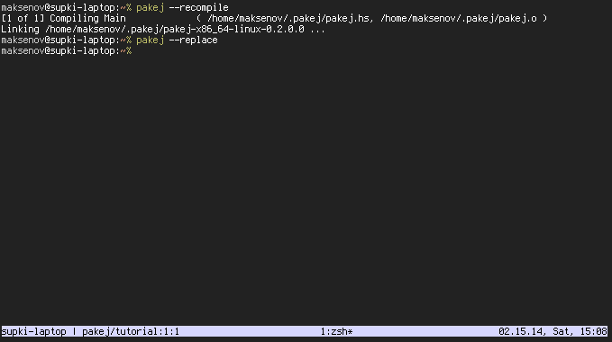
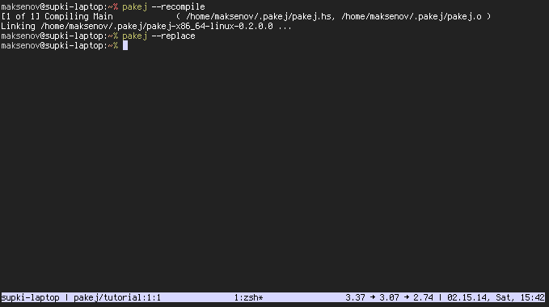

The Pakej Tutorial
==================

Prologue
--------

Here I assume you've successfully installed `pakej` package already. I encourage you
to test the assumption by executing

```
$ ghc -e 'import Pakej'
```

or, in case you're using sandboxes,

```
$ ghc -e 'import Pakej' "-package-db=$PACKAGE_DB"
```

command, where `$PACKAGE_DB` is the path to the sandbox `.conf.d` directory (it's
`.cabal-sandbox/x86_64-linux-ghc-7.6.3-packages.conf.d` on my machine, for instance,
but it can be different on yours). The expected result is GHC staying silent.
If you see something akin to:

```
<no location info>:
    Could not find module `Pakej'
```

that means Pakej has __not__ been installed successfully!

What this tutorial is all about?
--------------------------------

This tutorial walks through the process of configuring Pakej. We start with nothing and
end up with a nice status bar for [tmux][tmux:homepage]. I expect some kind of familiarity
with the command line, but you don't need to install tmux if you don't like it—there will
be screen captures illustrating our progress.

Starting out
------------

First, let's initialize Pakej environment:

```
$ pakej --init
```

This will create `~/.pakej` directory and populate it with the `pakej.hs` template.
Go look at it! ..It's not very interesting, but that's a start. We can compile it:

```
$ pakej --recompile
...
```

and even run:

```
$ pakej
```

It's a daemon, so you won't see any useful output right away, but you can look up the
pakej process with tools like `ps` or `pgrep`, say.

Let's make our first widget!

What are widgets?
-----------------

Widgets, in Pakej terms, are smallish, composable things that generate other
useful things—think text—over time. For example, you can think about date as the string
"14.02.2014" today and the string "15.02.2014" tomorrow. So, if we want the datetime widget
we'd start with a function that can produce something similar:

```haskell
import Data.String (IsString(..))
import Data.Text.Lazy (Text)
import Data.Time (formatTime, getZonedTime)
import System.Locale (defaultTimeLocale)

datetime :: IO Text
datetime = fmap format getZonedTime
 where format       = fromString . formatTime defaultTimeLocale formatString
       formatString = "%m.%d.%y, %a, %H:%M"
```

Whoa, that was fast! Let me explain. `datetime` generates strings like "02.15.14, Sat, 09:05"
using [time][hackage:time] and [old-locale][hackage:old-locale] packages. Both come with GHC, so you
do not need to worry about installing them manually. `getZonedTime` gets the local time blob
that respects current timezone. `formatTime` formats this blob using a format string.

Next, we need to wrap `datetime` in a `text` widget, so Pakej can understand to call it
repeatedly and to send its results down the pipeline:

```haskell
import Pakej
import Prelude hiding ((.), id)

main :: IO ()
main = pakej $ text datetime
```

Almost all Pakej machinery is in place, we only need to label the widget's
result so we can lookup it later:

```haskell
{-# LANGUAGE OverloadedStrings #-}

main :: IO ()
main = pakej $ private "datetime" . text datetime
```

Let's try it:

```
$ pakej --recompile
$ pakej --replace
$ pakej --stat
datetime
$ pakej datetime
02.15.14, Sat, 10:58
```

Seems to work! Next step is to update tmux configuration file, `~/.tmux.conf`:

```
set-option -g status-right-length 50
set-option -g status-right '#(pakej datetime)'
```



You can find full source code for this example in [`example/datetime.hs`][example:datetime].

Aggregation
-----------

A single widget is cool, but we want more! For example, we also want to see average
load in the tmux status bar. We can write a simple function to parse `/proc/loadavg`
and wrap it in a `text` widget:

```haskell
import Data.List (intercalate)

main :: IO ()
main = pakej $ private "datetime" . text datetime
            -- private "loadavg" . text loadavg

loadavg :: FilePath -> IO Text
loadavg = fmap (fromString . intercalate " → " . take 3 . words) . readFile
```

But how do we compose both widgets' values nicely separated by a bar into a single string?
Here's where `aggregate` comes in:

```haskell
main :: IO ()
main = pakej $ private "status" . aggregate $
  [ private "loadavg"  . text (loadavg "/proc/loadavg")
  , private "datetime" . text datetime
  ]
```

So, let's try it:

```
$ pakej --recompile
$ pakej --replace
$ pakej --stat
datetime loadavg status
$ pakej datetime
02.15.14, Sat, 11:31
$ pakej loadavg
0.72 → 0.62 → 0.50
$ pakej status
0.72 → 0.62 → 0.50 | 02.15.14, Sat, 11:31
```

Very nice! Now tmux configuration needs an update:

```
set-option -g status-right-length 50
set-option -g status-right '#(pakej status)'
```



You can find full source code for this example in [`example/aggregation.hs`][example:aggregation].

Parting thoughts
----------------

There's much more to Pakej: non-static widgets, widgets quering other Pakej instances,
Pakej REPL and more, but all this is left for reader to explore.

 [tmux:homepage]: http://tmux.sourceforge.net/
 [hackage:time]: https://hackage.haskell.org/package/time
 [hackage:old-locale]: https://hackage.haskell.org/package/old-locale
 [example:datetime]: https://github.com/supki/pakej/example/datetime.hs
 [example:aggregation]: https://github.com/supki/pakej/example/aggregation.hs
